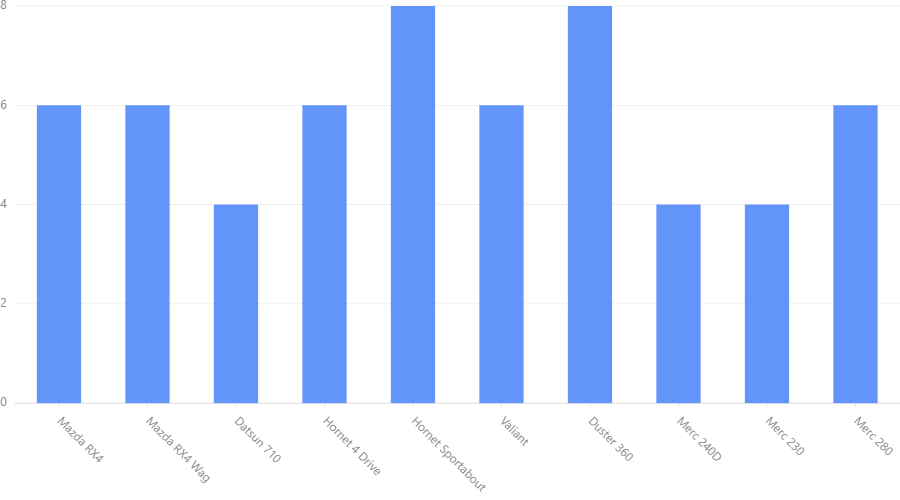

Create Your First Chart with pyG2
====================================

Installation
-------------

``pip install pyG2``

pyG2 only supports jupyter notebook. (Jupyterlab and Colab is not still supported.)

* Open jupyter notebook and create a new notebook file.

* Import G2 module::

    from pyG2 import G2

* Prepare the data set (Details of several cars from *mtcars* dataset)::

    data =[
    {'name': 'Mazda RX4', 'mpg': 21.0, 'cyl': 6},
    {'name': 'Mazda RX4 Wag', 'mpg': 21.0, 'cyl': 6},
    {'name': 'Datsun 710', 'mpg': 22.8, 'cyl': 4},
    {'name': 'Hornet 4 Drive', 'mpg': 21.4, 'cyl': 6},
    {'name': 'Hornet Sportabout', 'mpg': 18.7, 'cyl': 8},
    {'name': 'Valiant', 'mpg': 18.1, 'cyl': 6},
    {'name': 'Duster 360', 'mpg': 14.3, 'cyl': 8},
    {'name': 'Merc 240D', 'mpg': 24.4, 'cyl': 4},
    {'name': 'Merc 230', 'mpg': 22.8, 'cyl': 4},
    {'name': 'Merc 280', 'mpg': 19.2, 'cyl': 6}
    ]

* Create the chart (Number of cylinders of each car)::

    chart = G2.Chart(height=500,width=900)
    chart.data(data)
    chart.interval().position('name*cyl')
    chart.render()

Output:

Explaination of code
----------------------

``G2.Chart()`` generates a chart object which holds details of the chart. Height and weight are optional. (Default is 500pt, 400pt).

``chart.data(data)`` provides data to the chart. There are two supported data formats: list of dictionaries as in the example or pandas.DataFrame.
(Latter is recommended.)

``chart.interval().position('name*cyl')`` specifies geometry and aesthetics of the chart. ``'name*cyl'`` is the map that is 
represented in the chart. It is represented as a position. We choose interval geometry (bars) to visualize the chart. 

``chart.render()`` renders the chart to the notebook output.

Try Other Geometries
----------------------

Use this code to generate a line chart::

    chart = G2.Chart(height=500,width=900)
    chart.data(data)
    chart.line().position('name*cyl')
    chart.render()

Output:
    .. image:: first_line.png

Try ``area``, ``point`` plots. **Hint: Change** ``line`` **in above code to these words.** 

Multiple plots
---------------

We shall create two graphs in one chart. 

#. Name vs. Miles for Galon (mpg) : line
#. Name vs. No. of Cylinders (cyl) : interval (bar)

code::

    chart = G2.Chart(height=500,width=900)
    chart.data(data)
    chart.line().position('name*cyl')
    chart.interval().position('name*mpg')
    chart.render()

Output:

    .. image:: first_multi.png

**Read our tutorials to learn how to generate various types of charts**

**Special Note:**

If graphs are not visible when the notebook reloads, restart the kernal and run the code again.

