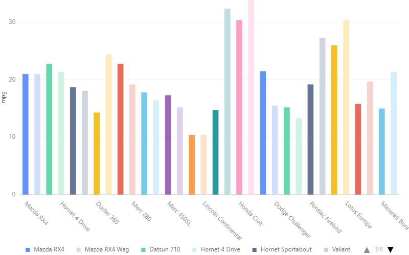
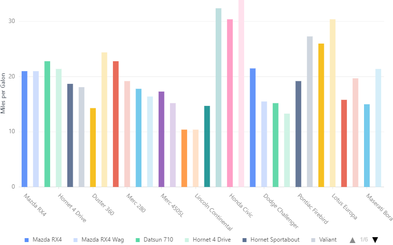

Axis Configurations
====================

Add axis title::

    chart = G2.Chart(height=500, width=800)
    chart.data(df)
    chart.axis('mpg',title={})
    chart.interval().position('name*mpg').color('name')
    chart.render()

If you want to change axis name you have to add::

    chart.scale('mpg',alias = 'Miles per Galon')
    chart.render()

Output:

