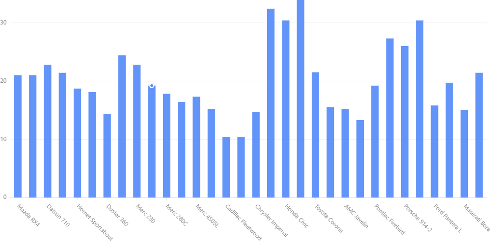
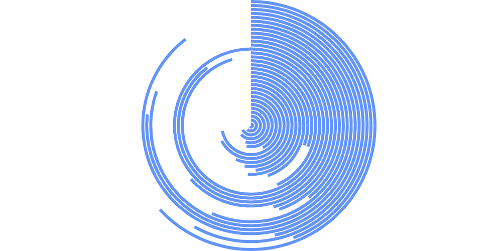
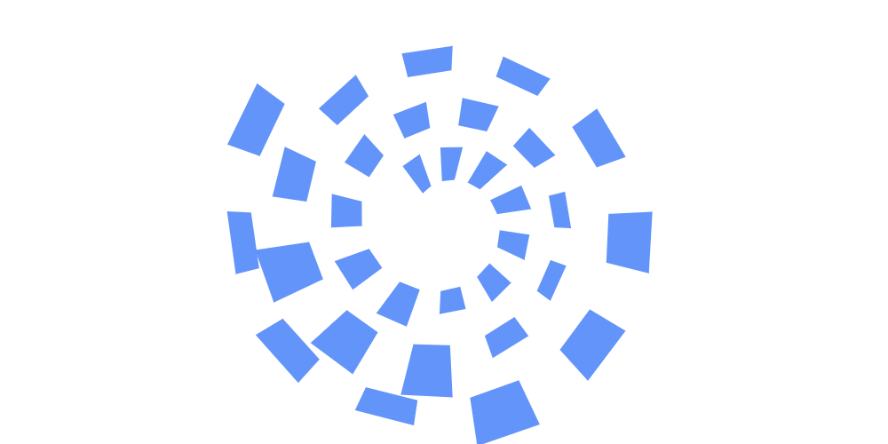
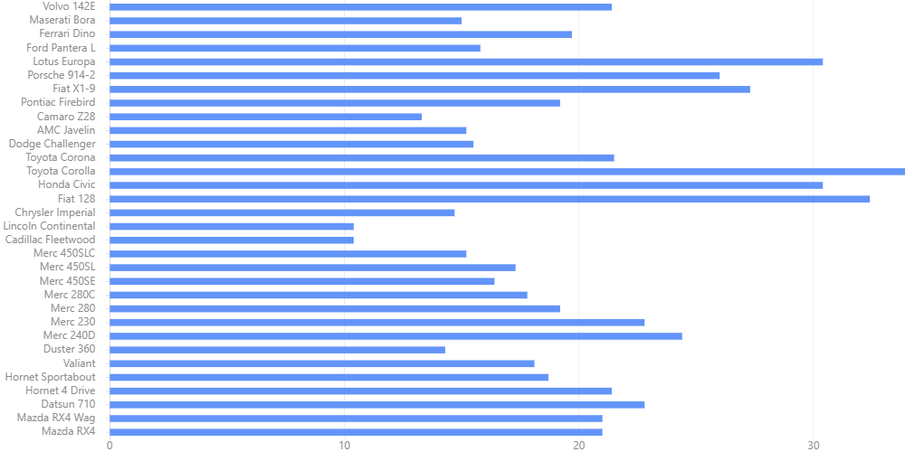
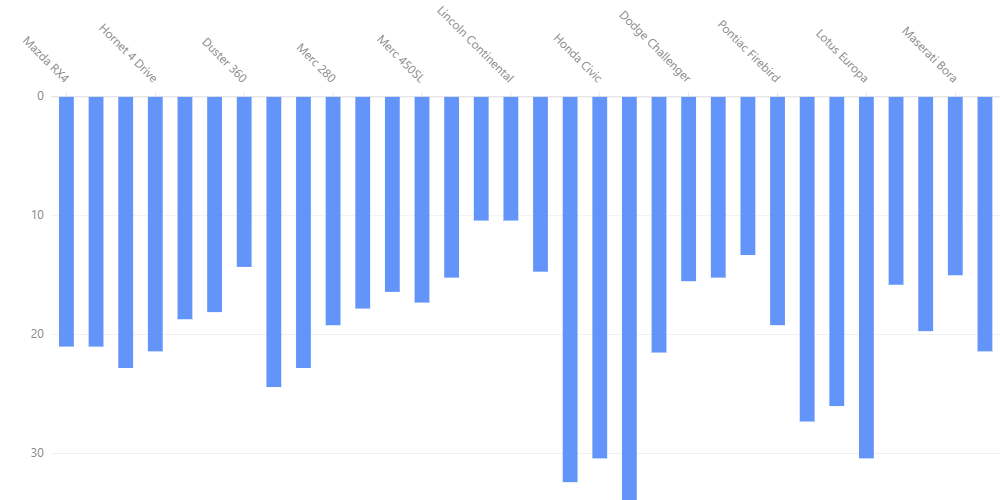
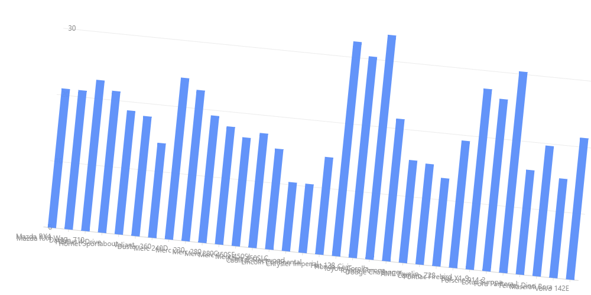
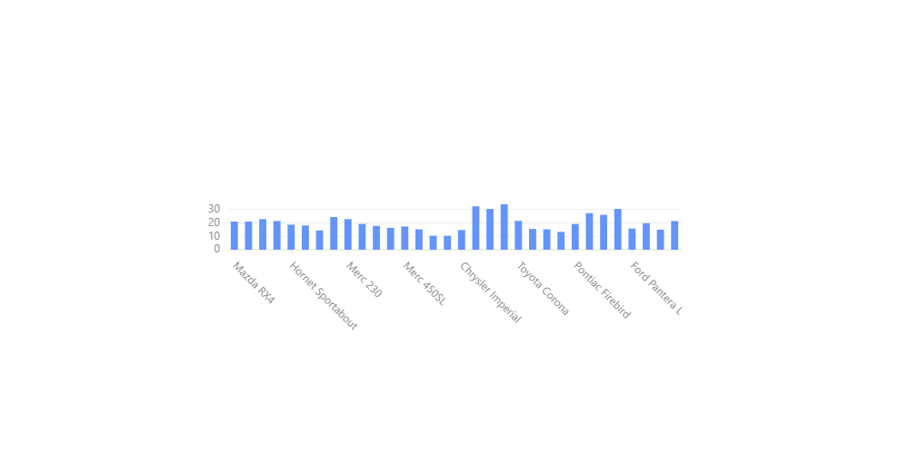

Coordinates
=============

We can specify coordinates as below::

    chart.coordinate('type')

There are four types.

#. ``rect``/ ``cartesian``    (x,y)::

    chart = G2.Chart(height=500, width=1000)
    chart.data(df)
    chart.interval().position('name*mpg')
    chart.coordinate('rect')
    chart.render()

Output:

#. ``polar``                  (r,theta)::

    chart = G2.Chart(height=500, width=1000)
    chart.data(df)
    chart.interval().position('name*mpg')
    chart.coordinate('polar')
    chart.render()

Output:

    .. image:: polar_coord.png

#. ``theta``                  (theta,r)::

    chart = G2.Chart(height=500, width=1000)
    chart.data(df)
    chart.interval().position('name*mpg')
    chart.coordinate('theta')
    chart.render()

#. ``helix`` ::

    chart = G2.Chart(height=500, width=1000)
    chart.data(df)
    chart.interval().position('name*mpg')
    chart.coordinate('helix')
    chart.render()

Output:

There are coordinate transformation functions.

#. transpose ::

    chart = G2.Chart(height=500, width=1000)
    chart.data(df)
    chart.interval().position('name*mpg')
    chart.coordinate('rect').transpose()
    chart.render()

Output:

#. reflect ::

    chart = G2.Chart(height=500, width=1000)
    chart.data(df)
    chart.interval().position('name*mpg')
    chart.coordinate('rect').reflect('y')
    chart.render()

Output:

#. rotate::

    chart = G2.Chart(height=500, width=1000)
    chart.data(df)
    chart.interval().position('name*mpg')
    chart.coordinate('rect').rotate(0.1)
    chart.render()

Output:

#. scale::

    chart = G2.Chart(height=500, width=1000)
    chart.data(df)
    chart.interval().position('name*mpg')
    chart.coordinate('rect').scale(0.5,0.1)
    chart.render()

