Geometry and Aesthetic
########################

Geometry
==============

Geometries are the main components of the chart. Geometries maps the variables into graphic space.

G2 supports:

point, line, area, interval, polygon, edge, schema geometry types.

point
-------
::

    chart.point().position('x*y')

This code generates points at the places specified by position aesthetic as (x,y).

Supported shapes are (default is ``hollow-circle``),

'circle', 'square', 'bowtie', 'diamond', 'hexagon', 'triangle', 'triangle-down', 'hollow-circle', 'hollow-square',
'hollow-bowtie', 'hollow-diamond', 'hollow-hexagon', 'hollow-triangle', 'hollow-triangle-down', 'cross',
'tick', 'plus', 'hyphen', 'line'

e.g. Different shapes ::

    data = pd.read_csv("mtcars.csv")
    chart = G2.Chart(width = 900)
    chart.data(data)
    chart.point().position('name*cyl').shape('hp')
    chart.render()

Output:

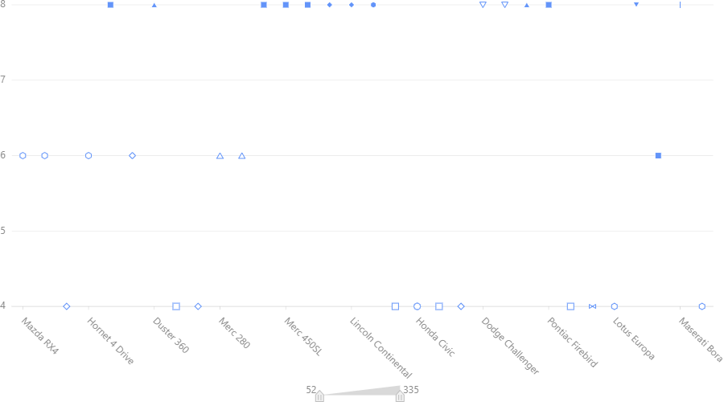

line
--------
::

    chart.line().position('x*y')

This code generates a line chart that is drawn connecting all points specified by position aesthetic. If shape or color
aesthetics are used then there will be several lines related to each aesthetic.

Supported shapes are

 'line',' dot', 'dash',' smooth', 'hv',' vh', 'hvh',' vhv'

('hv',' vh', 'hvh',' vhv' are used for ladder diagrams: h horizontal, v vertical)

e.g. Some line shapes comparison::

    data = pd.read_csv("mtcars.csv")
    chart = G2.Chart(width = 900)
    chart.data(data)
    chart.line().position('name*wt').shape('smooth').color('red')
    chart.line().position('name*wt').shape('line').color('blue')
    chart.line().position('name*wt').shape('vh').color('orange')
    chart.render()

Output:

    .. image:: geom_charts/line_shapes.png

area
-----------------
::

    chart.area().position('x*y')

This code generates area chart. Here under the field ``y`` there may be a single value or a list of two values

If ``y`` is a single value then the area is the area under the line drawn by connecting (x,y) points.
If ``y`` is a list then the area is between two y values is the area.

Shape and line aeasthetics generates seperate area for each set.
Supported shapes are

 'area', 'smooth', 'line', 'smooth-line'

(when line and smooth-line is used the area is not filled - only the border.)

e.g. ::

    data = [{'x':'a','y':[3,4],'z':2},{'x':'b','y':[5,9],'z':3},{'x':'c','y':[2,4],'z':1}]
    chart = G2.Chart(width = 900)
    chart.data(data)
    chart.area().position('x*y')
    chart.area().position('x*z').color('red')
    chart.scale('z', min=0,max=9).scale('y',min=0,max=9)
    chart.render()

Output:

    .. image:: geom_charts/area.png

**N.B:**

**If we use lists in lines and points then there will be several lines and points for each record.**

interval
-------------

::

    chart.interval().position('x*y')

If ``y`` is a single value then the interval is the interval between y value and 0.
If ``y`` is a list then the interval is between two y values is the interval.
If ``x`` is a single value the is of a default fixed width bar at (x,y)
If ``x`` is a list then the interval is a bar spreaded between first and second value of the list.

e.g ::

    data = [{'x':'a','y':[3,4],'z':2},{'x':'b','y':[5,9],'z':3},{'x':'c','y':[2,4],'z':1}]
    chart = G2.Chart(width = 900)
    chart.data(data)
    chart.interval().position('x*y')
    chart.interval().position('x*z').color('red')
    chart.scale('z', min=0,max=9).scale('y',min=0,max=9)
    chart.render()

Output:

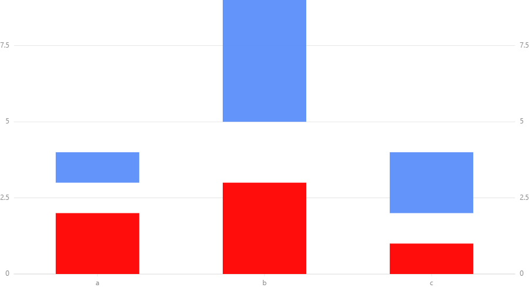

Another example::

    data = [{'x':'a','y':[3,4],'z':2},{'x':'b','y':[5,9],'z':3},{'x':'c','y':[2,4],'z':1}]
    chart = G2.Chart(width = 900)
    chart.data(data)
    chart.interval().position('y*z')
    chart.scale('z', min=0,max=9)
    chart.render()

Output:

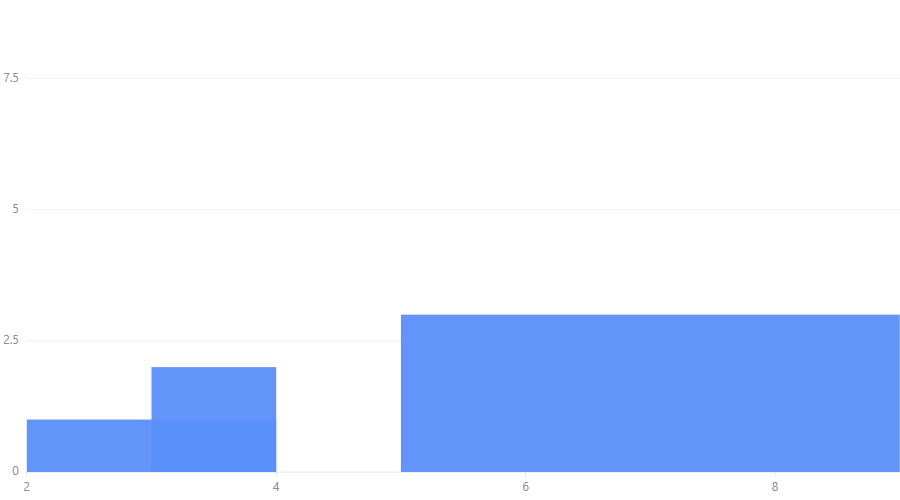

Supported shapes are 

'rect', 'hollow-rect', 'line', 'tick', 'funnel', 'pyramid'

'funnel' is for funnel chart.
'pyramid' is for pyramid chart.

polygon
-------------

::

    chart.polygon().position('x*y')

``x`` and ``y`` are lists such that corresponding values of two lists gives coordinates of the vertices.
(Vertices are connected as they are ordered in two lists.)

Shape and size aesthetics are not related to polygons.

e.g. ::

    data = [{'x':[1,2,3],'y':[4,8,6]},{'x':[5,6,7,8,6],'y':[5,9,10,7,4]}]
    chart = G2.Chart(width = 900)
    chart.data(data)
    chart.polygon().position('x*y')
    chart.scale('y',min=0,max=12)
    chart.render()

Output:

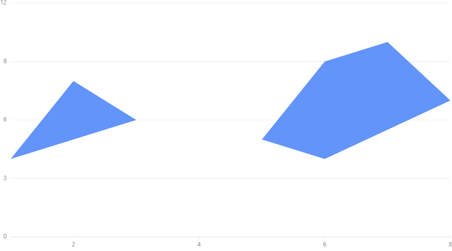

edge
---------

Edge connects the points specified in two lists for x coordinates and y coordinates.

e.g. ::

    data = [{'x':[1,2,3],'y':[4,8,6]},{'x':[5,6,7,8,6],'y':[5,9,10,7,4]}]
    chart = G2.Chart(width = 900)
    chart.data(data)
    chart.edge().position('x*y')
    chart.scale('y',min=0,max=12)
    chart.render()

Output:

    .. image:: geom_charts/edge.png

schema
---------
::

    chart.schema().position('x*y')

If the map is one dimensional then list must be supplied.

When the map is two dimensional,

``x`` is categorical variable and ``y`` is an array of values.

Supported shapes:

'box'

e.g. ::

    data = [{'x':'a','y':[1,2,3,4,5]},{'x':'b','y':[5,9,10,11,12]}]
    chart = G2.Chart(width = 900)
    chart.data(data)
    chart.schema().position('x*y').shape('box')
    chart.scale('y',min=0)
    chart.render()

Output:

    .. image:: geom_charts/box.png

Aesthetics
=============

position
-----------

:: 

    chart.<geometry>().position('x*y')

This part is completed under the previous section.

shape
-----------

:: 

    chart.<geometry>().position('x*y').shape('z')

If we put a specific shape to ``z`` that given under geometries the geometry will take that shape. If we give a variable
name to ``z`` the shape will change with the value of that variable. 

As below we can specify shapes we want to use as an optional argument

:: 

    chart.<geometry>().position('x*y').shape('z',*values)

e.g. ::

    data = pd.read_csv("mtcars.csv")
    chart = G2.Chart(width = 900)
    chart.data(data)
    chart.point().position('name*cyl').shape('cyl','circle','square','triangle')
    chart.render()

Output:

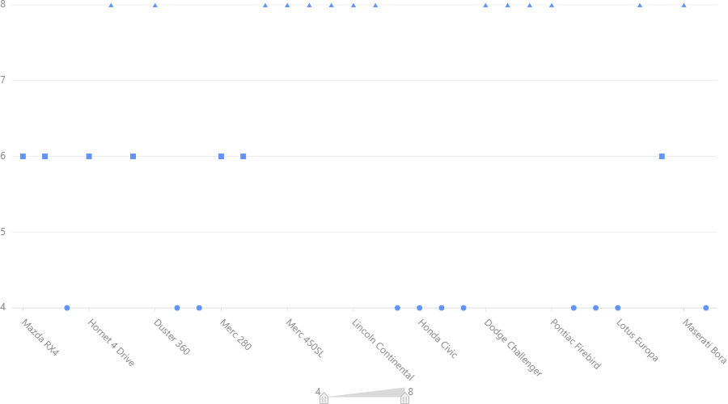

color
----------

::

    chart.<geometry>().position('x*y').color('z')

e.g. ::

    data = pd.read_csv("mtcars.csv")
    chart = G2.Chart(width = 900)
    chart.data(data)
    chart.interval().position('name*cyl').color('hp')
    chart.render()

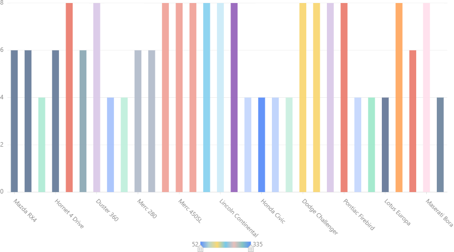

or

::

    chart.<geometry>().position('x*y').color('z',*values)

e.g.::

    data = pd.read_csv("mtcars.csv")
    chart = G2.Chart(width = 900)
    chart.data(data)
    chart.interval().position('name*cyl').color('hp','red','blue','yellow')
    chart.render()

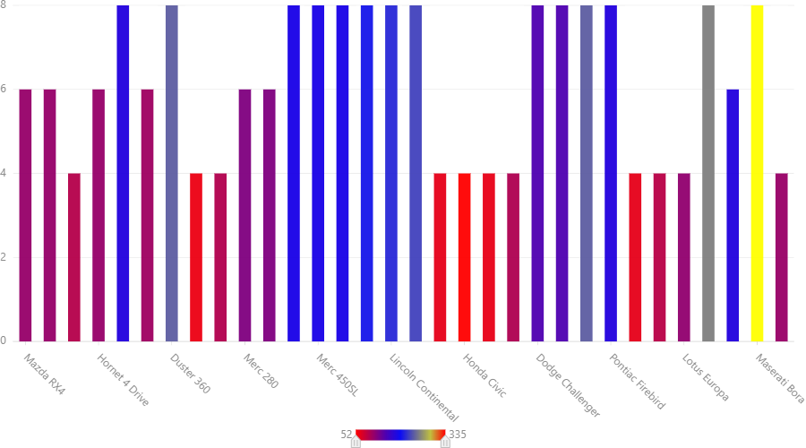

The colour range is prepared by interpolation. Therefore if you put 'white' and 'black' you can get a greyscale chart.

::

    chart.<geometry>().position('x*y').color(color)

Here ``values`` are list of colors to be used and  ``color`` is a color if one color is used for complete geometry.

size
----------

::

    chart.<geometry>().position('x*y').size('z')

or

::

    chart.<geometry>().position('x,y').size(value)

The size can be changed according to a field or you can specify a definite value to the size.

.. image :: geom_charts/size.png

Another example::

    data = pd.read_csv("mtcars.csv")
    chart = G2.Chart(width = 900)
    chart.data(data)
    chart.scale('cyl', min=3,max=9)
    chart.line().position('name*cyl').size(5)
    chart.render()

Output:

.. image :: geom_charts/size_const.png

Label
=======

::

    chart.<geometry>().position('x*y').label('z')

e.g.::

    data = pd.read_csv("mtcars.csv")
    chart = G2.Chart(width = 900)
    chart.data(data)
    chart.point().position('mpg*hp').label('name')
    chart.render()

Output:

.. image :: geom_charts/label.png

You can see this label is little messy this can be handled this way::

    data = pd.read_csv("mtcars.csv")
    chart = G2.Chart(width = 900)
    chart.data(data)
    chart.point().position('mpg*hp').label('name',layout={"type":'fixed-overlap'})
    chart.render()

Output:

.. image :: geom_charts/label_overlap.png

``fixed-overlap`` remove some of the labels to make the graph clear. Use ``overlap`` to reposition colliding labels
without  removing any. 

Collision Handelling
=======================

Sometimes several parts of the graphs collides, that is to say locate in the overlapping positions.
We can fix this by ``adjust()``

There are several ``adjust`` types. ``stack`` to make colliding parts in a stack. ``dodge`` to present them
horizontally packed. ``jitter`` in point maps to show them as a cluster.

e.g. chart with Collision

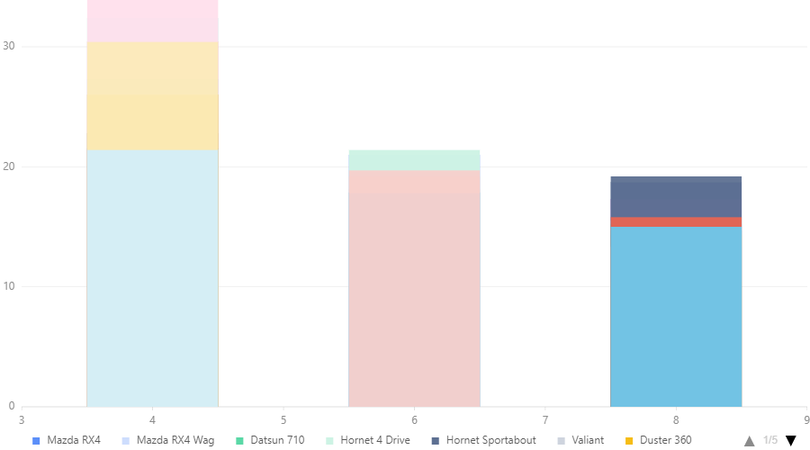

e.g. stacked chart::

    data = pd.read_csv("mtcars.csv")
    chart = G2.Chart(width = 900)
    chart.data(data)
    chart.interval().position('cyl*mpg').color('name').adjust('stack')
    chart.render()

Output:

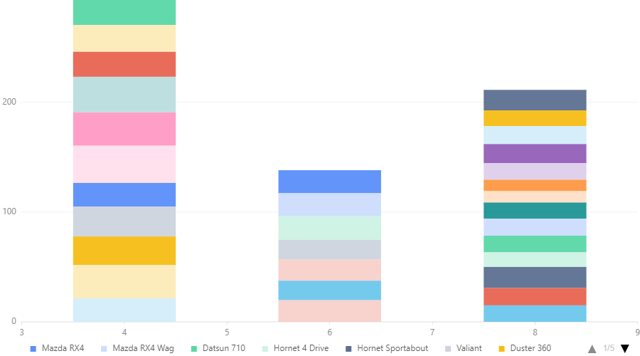

e.g. dodged chart::

    data = pd.read_csv("mtcars.csv")
    chart = G2.Chart(width = 900)
    chart.data(data)
    chart.scale('cyl',type='cat', values =[4,6,8])
    chart.interval().position('cyl*mpg').color('name').adjust('dodge')
    chart.render()

Output:

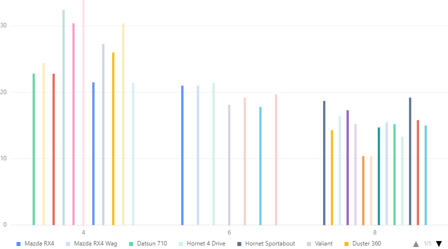

e.g. jitter charts::

    data = pd.read_csv("mtcars.csv")
    chart = G2.Chart(width = 900)
    chart.data(data)
    chart.scale('cyl',type='cat', values =[4,6,8])
    chart.point().position('cyl*mpg').color('name').adjust('jitter')
    chart.render()

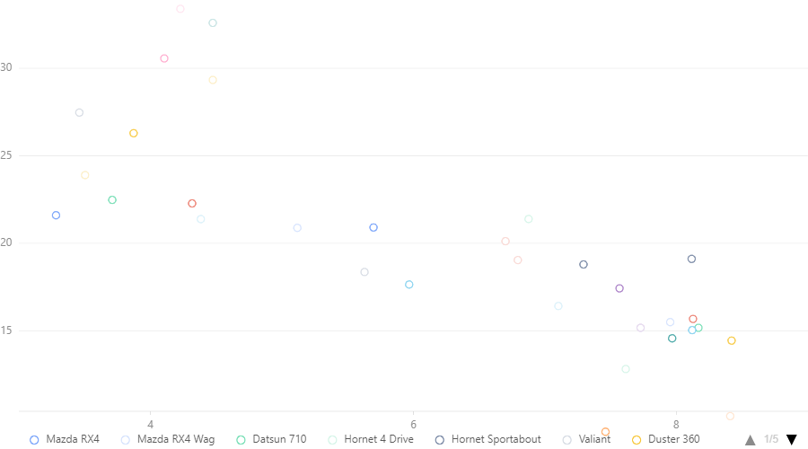